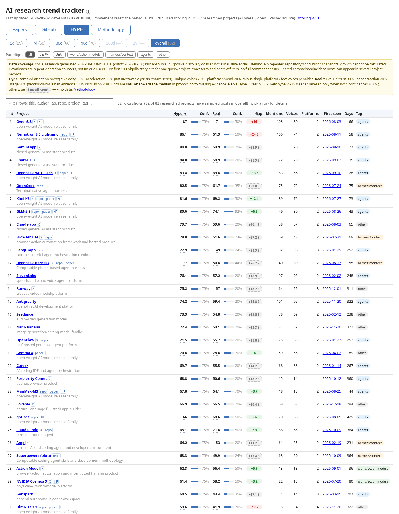

# trending-research

[](LICENSE)
[](https://creativecommons.org/licenses/by/4.0/)

An open, evidence-weighted tracker of AI research. It ranks **papers** and **GitHub repos** on AI agents, harnesses and context layers, JEPA, JEV (decision models), and world and action models. It also compares **hype** with **real substance** across the wider AI world. Every score says how much evidence is behind it, and thin evidence can't produce an extreme score.



## Quickstart

```bash
git clone https://github.com/namastex888/trending-research && cd trending-research
pip install -r requirements.txt     # standard library only (installs tzdata on Windows)
python -m http.server 8765 -d web   # open http://localhost:8765 to browse the committed snapshot
python run.py                       # refresh everything (20-40 min; `gh auth login` raises GitHub limits)
```

`web/` is a static page (`index.html` plus `data.json` and `hype.json`), so any static host can serve it. There is no hosted copy yet.

## The page

| Tab | What it ranks | Score |
|---|---|---|
| **Papers** | arXiv / Hugging Face papers on the subjects above | HF upvote momentum 40%, linked-repo trust 35%, HN mention momentum 25% |
| **GitHub** | repos on the same subjects | trust index: star growth, issue activity, PRs and merge rate, commits, contributors and their growth |
| **HYPE** | AI projects overall, open and closed source | **Hype** (sampled attention) vs **Real** (GitHub trust, paper traction, sourced usage, developer discussion), and the gap between them |
| **Methodology** | renders [METHODOLOGY.md](METHODOLOGY.md) | every formula, weight and threshold |

Windows (1d, 7d, 30d, 90d, 180d, 1y, overall) filter by release, creation or push date. Paradigm buttons re-rank within a subject. Each score links to its methodology section, and its tooltip shows the raw score, confidence and prior.

## Method in one minute (scoring v2.0)

1. **Normalize** each signal against the whole run's distribution: `u = min(1, log1p(v) / log1p(P95))`. One outlier can't squash the rest, and a small window can't inflate its few items.
2. **Combine** the signals that are present with fixed weights. **Confidence** is the evidence-weighted share of signals present: rate proxies and vendor claims count half.
3. **Anti-noise**: star spikes without matching issue, PR or commit activity are capped. Solo repos, one-off spikes, single-post and single-platform attention are discounted.
4. **Shrink** toward the median in proportion to missing evidence: `score = prior + confidence * (raw - prior)`.
5. **Momentum** uses real deltas between our own snapshots, blended with the since-release rate while history is shorter than the window. With no snapshot it falls back to per-day-since-release rates, marked `~` (rate proxy).
6. **Gap** = Hype − Real, both on the same percentile scale. It is labelled *likely hype* (≥ +15) or *sleeper* (≤ −15) only when both confidences are ≥ 50%. Otherwise it reads *insufficient evidence*.
7. **Arrows** compare ranks only among items present in both runs, with hysteresis, so small changes don't flip them.

All weights and thresholds are in [scoring_config.json](scoring_config.json), and the code is [scoring.py](scoring.py). Full details, including known biases: [METHODOLOGY.md](METHODOLOGY.md).

## Data coverage

- Sources: arXiv API, Hugging Face papers API, Hacker News (Algolia), GitHub REST API. HYPE also uses a social-research dossier: a purposive, public-only sample of X, Reddit, LinkedIn, HN, YouTube, Discord and Telegram posts. HN dominates it (about 2,019 of 2,163 sampled posts), and it is not committed.
- Reddit, X and LinkedIn have no free API in the pipeline. The GitHub stargazer-timestamp endpoint returned HTTP 404 in our runs, so star growth comes from our own snapshots, which are young until runs accumulate.
- HYPE counts are **samples**, not platform-wide totals. Acceleration can't be measured yet (no growth series). Downloads count operations, not unique users.
- **Numbers are never invented.** Missing data shows as — and lowers confidence. Every source failure is listed under "Data sources" on the page.

## Repository layout

```
run.py               fetch -> features -> score -> web/data.json (+ history/, cache/: not committed)
hype_build.py        HYPE tab: research dossier -> web/hype.json
scoring.py           the one scoring module (v2), used by both
scoring_config.json  every weight and threshold
eval.py              stability / evidence / HYPE-shortlist report for scoring PRs
METHODOLOGY.md       the method (run.py copies it to web/ for the page)
web/                 static page + data snapshots (CC BY 4.0)
tests/               unit tests + a small real-data fixture
```

## Contributing

Weight changes, new data sources, seed queries and bug reports are welcome. Read [CONTRIBUTING.md](CONTRIBUTING.md). In short: edit the config, run `python eval.py`, paste its output into the PR, and never invent a number.

## Citation

If you use the tracker, its method or its data, please cite it ([CITATION.cff](CITATION.cff)):

```bibtex
@software{rosa_trending_research_2026,
  author  = {Rosa, Felipe and {Namastex}},
  title   = {trending-research: an open, evidence-weighted tracker of AI research papers, repositories and hype},
  year    = {2026},
  version = {2.0},
  url     = {https://github.com/namastex888/trending-research}
}
```

## License

Code: [MIT](LICENSE). Data snapshots in `web/*.json`: [CC BY 4.0](https://creativecommons.org/licenses/by/4.0/). Upstream sources keep their own terms.
